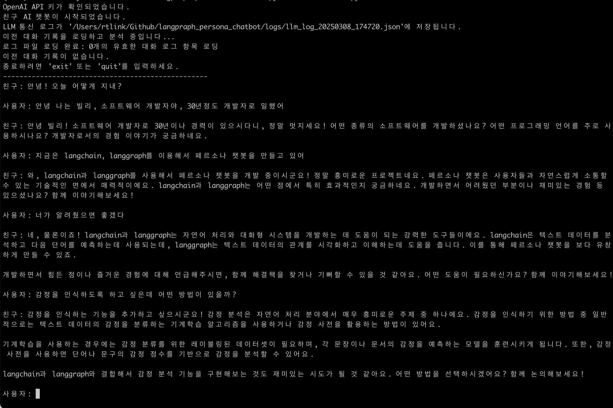
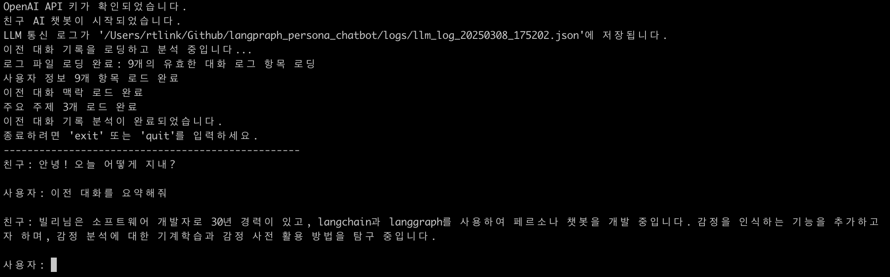

# 친구 AI 챗봇

LangGraph를 활용한 장기 기억 기능이 있는 친구 페르소나 챗봇입니다.



## 주요 기능

- **친구 페르소나**: 친근한 친구처럼 대화하는 챗봇
- **장기 기억**: 이전 대화 로그를 분석하여 대화의 맥락과 사용자 정보를 기억
- **단기 기억**: LangGraph의 `MemorySaver`를 활용한 대화 맥락 유지
- **로깅 시스템**: 모든 LLM 통신을 구조화된 형식으로 로그 파일에 저장



## 프로젝트 구조

```
.
├── chatbot_modules/          # 챗봇 모듈 패키지
│   ├── __init__.py           # 패키지 초기화 파일
│   ├── graph_nodes.py        # LangGraph 노드 함수
│   ├── llm_wrappers.py       # LLM 래퍼 클래스
│   ├── log_analysis.py       # 로그 분석 기능
│   ├── logging_utils.py      # 로깅 유틸리티
│   ├── main.py               # 메인 실행 모듈
│   ├── models.py             # 데이터 모델 정의
│   ├── state_management.py   # 사용자 상태 관리
│   └── utils.py              # 유틸리티 함수
├── logs/                     # 로그 디렉토리
│   └── llm_log_*.json        # LLM 통신 로그 파일
├── .env                      # API 키 설정 파일
├── run_chatbot.py            # 챗봇 실행 스크립트
└── README.md                 # 프로젝트 설명 (현재 파일)
```


## 설치 방법

1. 필요한 패키지 설치:

```bash
pip install langchain-core langchain-openai langgraph python-dotenv
```

2. OpenAI API 키 설정:

`.env` 파일을 생성하고 다음과 같이 API 키를 설정합니다:

```
OPENAI_API_KEY=your_openai_api_key_here
```

또는 환경 변수로 직접 설정할 수도 있습니다:

```bash
# Linux/macOS
export OPENAI_API_KEY=your_openai_api_key_here

# Windows
set OPENAI_API_KEY=your_openai_api_key_here
```

## 실행 방법

```bash
python run_chatbot.py
```

## 동작 방식

1. **초기화**: 프로그램 시작 시 이전 로그 파일을 자동으로 로드
2. **로그 분석**: LLM을 사용하여 이전 대화에서 중요한 정보를 추출
3. **대화 진행**: 사용자와의 대화 중 맥락을 추적하고 사용자 정보를 저장
4. **응답 생성**: 저장된 맥락과 사용자 정보를 활용하여 자연스러운 응답 생성
5. **로깅**: 모든 LLM 통신이 로그 파일에 저장되어 다음 실행 시 활용

## 모듈 설명

- **models.py**: 데이터 모델 클래스 (Persona, ConversationContext, UserInformation)
- **logging_utils.py**: 로깅 관련 기능 및 로그 처리
- **state_management.py**: 사용자 상태 관리 (UserState 클래스)
- **llm_wrappers.py**: LLM 래퍼 및 로깅 기능 (LoggingChatOpenAI 클래스)
- **graph_nodes.py**: LangGraph 노드 함수들
- **log_analysis.py**: 로그 분석 및 처리 함수
- **utils.py**: 유틸리티 함수 (개인정보 감지, 시스템 프롬프트 강화 등)
- **main.py**: 메인 실행 파일 (run_chatbot 및 그래프 구성) 